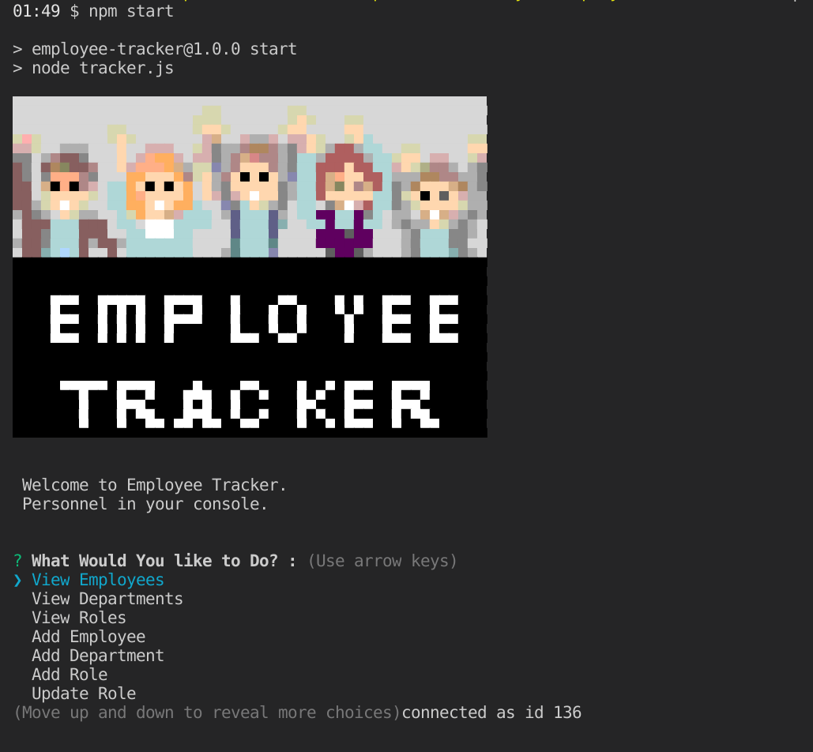
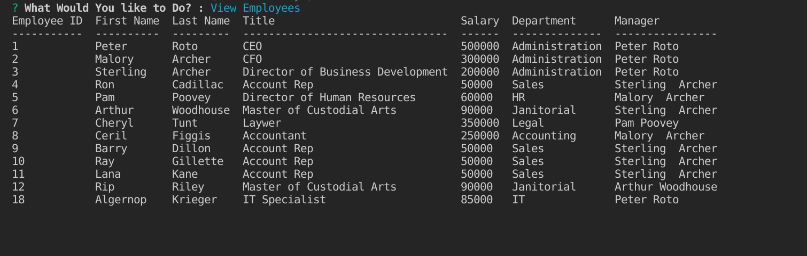
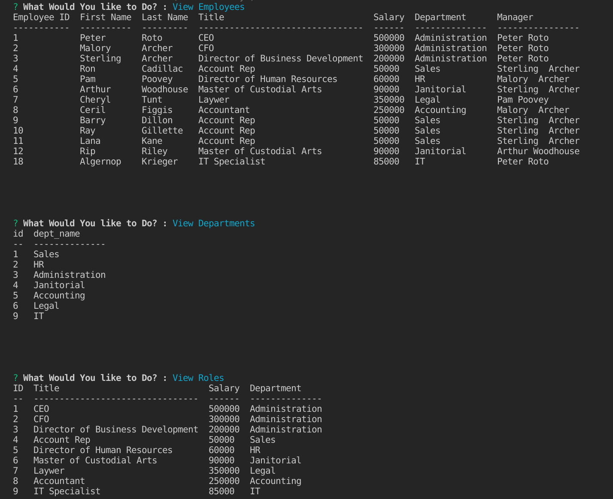

  <h1 align="center">Employee Tracker 🎉 </h1>
    
  <br />
  
  ## 👇  Description  👇
---
  
  A console based employee tracker, showcasing competence in SQL,JS and NODEjs.
 
  ## Table of Contents 
  - [Description](#--description--)
  - [Installation Instructions 📣](#installation-instructions-)
  - [Usage 🖱️](#usage-️)
  - [Contributors 🧑‍🤝‍🧑](#contributors-)
  - [Screenshots 📷](#screenshots-)
  - [Questions ❔](#questions-)
  - [License ©️](#license-️)
    
  ## Installation Instructions 📣
---

  1. Clone Repo
  2. Run ``` npm i```  in repo directory  
  3. Run  ``` npm start ``` in terminal. 
  
  ## Usage 🖱️
---
A hypothetical use case would be:
```

As a business owner
I want to be able to view and manage the departments, roles, and employees in my company
So that I can organize and plan my business

```
  
  
  ## Contributors 🧑‍🤝‍🧑
---
  Peter Roto
  
  ## Screenshots 📷
---

  |                  Welcome View              | Employee Table                               | Tiple View                               | 
  |:------------------------------------------------------:|:------------------------------------------------------:|:------------------------------------------------------:|
  |  |||
  |                                                        |                                                        |                                                        |
  |                                                        |                                                        |                                                        |   

## Video 📹️

| Demonstration Video | 
|:----:|
|                     |


  ## Questions ❔

---

  Email me at support@peterroto.com<br />
  <br />
  :octocat: Find me on GitHub: [Proto133](https://github.com/Proto133)<br />
  <br />
  📬 Email me with any questions: support@peterroto.com<br /><br />
  
  ## License 
---
  <br />
  This application is covered by <a href="https://opensource.org/licenses/ISC"> the ISC License</a> license. 
<br />

----------

ISC License (ISC)

Copyright 2021 Peter Roto

Permission to use, copy, modify, and/or distribute this software for any purpose with or without fee is hereby granted, provided that the above copyright notice and this permission notice appear in all copies.

THE SOFTWARE IS PROVIDED "AS IS" AND THE AUTHOR DISCLAIMS ALL WARRANTIES WITH REGARD TO THIS SOFTWARE INCLUDING ALL IMPLIED WARRANTIES OF MERCHANTABILITY AND FITNESS. IN NO EVENT SHALL THE AUTHOR BE LIABLE FOR ANY SPECIAL, DIRECT, INDIRECT, OR CONSEQUENTIAL DAMAGES OR ANY DAMAGES WHATSOEVER RESULTING FROM LOSS OF USE, DATA OR PROFITS, WHETHER IN AN ACTION OF CONTRACT, NEGLIGENCE OR OTHER TORTIOUS ACTION, ARISING OUT OF OR IN CONNECTION WITH THE USE OR PERFORMANCE OF THIS SOFTWARE.

  --------------------------- 
 

  This README was generated with writemeREADME. 
  
  Find it on:  
  [Github](https://github.com/proto133/writemeREADME) 
    or 
  [NPMJS](https://www.npmjs.com/package/writemereadme)
  
